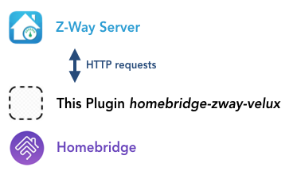

# homebridge-zway-velux
[](https://www.npmjs.com/package/homebridge-zway-velux)

Homebridge plugin for controlling Velux blinds by triggering Z-Wave switches via HTTP using a Z-Way Server instance.

This plugin is all about triggering switches by performing HTTP requests to a Z-Way Server. In my case, I used Fibaro FGS-222 Z-Wave switches. One of the switches is connected to the power supply of the Velux shutter blinds and the other one to a Velux KLF 050 controller module, which actually controls the blinds' movement. The switch for the power supply is optional and enables the power supply to be completely disconneced from the electric power when the blinds are not moving (to silence the transformators and to save energy).

## Setup

### Hardware Stack

The hardware setup is shown as follows. I use a RaZberry module for my Raspberry Pi to communicate with the Z-Wave switches. These are connected to the blinds' power supply and to the Velux KLF 050 controller, which controls the blinds wirelessly.


### Software Stack

To get the plugin working, an installed Z-Way Server is required. With the Z-Way Server, you can manage all your Z-Wave devices, in this case 2 Fibaro GS-222 switches. The Z-Way Server allows to utilize devices via HTTP requests, which is the main purpose of this plugin.



## Installation

First, install [Homebridge](https://homebridge.io). See [https://www.npmjs.com/package/homebridge](https://www.npmjs.com/package/homebridge) for more information.

Then install this plugin:
```
$ sudo npm install homebridge-zway-velux -g
```
If you are having permission problems during install, try this:
```
$ sudo npm install homebridge-zway-velux -g --unsafe-perm
```

To add this plugin to a Homebridge installation, you have to add a new accessory to the config.json file. The configuration variables are described in the following table:

| Variable | Description | Default |
| --------- | ------------- | --------- |
| accessory | System name of the accessory (do not change the default value) | ZWayVelux |
| name | Name of the shutter blinds to appear in the Home App | Blinds |
| power_url | Z-Way API URL to switch on the power supply (absolute) | (none) |
| power_off_url | Z-Way API URL to switch off the power supply (absolute) | (none) |
| up_url | Z-Way API URL to start opening the blinds (absolute) | (none) |
| up_off_url | Z-Way API URL to stop opening the blinds (absolute) | (none) |
| down_url | Z-Way API URL to start closing the blinds (absolute) | (none) |
| down_off_url | Z-Way API URL to stop closing the blinds (absolute) | (none) |
| move_percent_duration | Number of milliseconds the blinds need to open or close 1 percent of the moving distance | (none) |
| start_delay | Number of milliseconds the blinds need to start moving after they are given a command to move up or down | (none) |
| end_delay | Additional number of milliseconds the blinds need to stop moving after they have opened or closed completely (Velux blinds use to move back a couple of centimeters after they reach an end position to prevent any damage caused by too much stress) | (none) |

Example config.json:

```
{
    ...
    
    "accessories": [
        {
            "accessory": "ZWayVelux",
            "name": "Blinds",
            "power_url": "http://localhost:8083/ZAutomation/api/v1/devices/ZWayVDev_zway_3-1-37/command/on",
            "power_off_url": "http://localhost:8083/ZAutomation/api/v1/devices/ZWayVDev_zway_3-1-37/command/off",
            "up_url": "http://localhost:8083/ZAutomation/api/v1/devices/ZWayVDev_zway_4-2-37/command/on",
            "up_off_url": "http://localhost:8083/ZAutomation/api/v1/devices/ZWayVDev_zway_4-2-37/command/off",
            "down_url": "http://localhost:8083/ZAutomation/api/v1/devices/ZWayVDev_zway_4-0-37/command/on",
            "down_off_url": "http://localhost:8083/ZAutomation/api/v1/devices/ZWayVDev_zway_4-0-37/command/off",
            "move_percent_duration": 375,
            "start_delay": 1750,
            "end_delay": 6000,
            "http_method": "GET"
        } 
    ]
}
```
## To Do

* Remove the initial security delay of 1s before starting to move the blinds
* Cancel the current movement and start over when the target position is changed while the blinds are moving

## Updates
* 2018-08-06: Published the first working prototype
* 2019-08-25: Updated documentation

## Useful Links
* [https://z-wave.me/products/razberry/](https://z-wave.me/products/razberry/)
* [RaZberry API Command Examples](https://gist.github.com/integrii/021f272f2cad0540fc3c)
